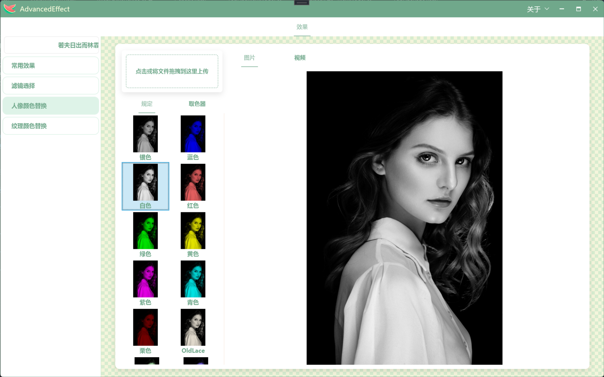

# 引用MagicEffects

<!-- PROJECT SHIELDS -->
[![Contributors][contributors-shield]][contributors-url]
[![Forks][forks-shield]][forks-url]
[![Stargazers][stars-shield]][stars-url]
[![Issues][issues-shield]][issues-url]
[![MIT License][license-shield]][license-url]

<!-- PROJECT LOGO -->
<br />
  <h3 align="center">Demo实现特效示例</h3>
<p align="center">
  <a href="https://github.com/CSGarden/CT.WPF.MagicEffects">
     
  </a>
</p>

 
## 使用到的库

- [CommunityToolkit.Mvvm](https://github.com/CommunityToolkit/dotnet)
- [样式库AduSkin(教学文档较少需要看源码学习)](https://github.com/aduskin/AduSkin)
- [调用摄像](#) 
    - [OpenCvSharp4.runtime.win](https://github.com/shimat/opencvsharp) 
    - [OpenCvSharp4.WpfExtensions](https://github.com/shimat/opencvsharp)

### 开发前的配置要求

1. demo使用的是.net8.0

#### **安装步骤**

1. nuget库搜索MagicEffects安装
2. 项目克隆


```sh
git clone https://github.com/CSGarden/CT.WPF.MagicEffects.git
```


### 贡献者
   [🆔CT](https://github.com/CSGarden)
   [🆔大头](https://github.com/BigHeadDev)

### 版本控制

该项目使用Git进行版本管理。您可以在repository参看当前可用版本。

### 作者
&ensp; 📱QQ:2467509148    

 *您也可以在贡献者名单中参看所有参与该项目的开发者。*

### 版权说明

该项目签署了GPL-2.0的开源协议，不允许商用

### 鸣谢
📸📱

<!-- links -->
[your-project-path]:shaojintian/Best_README_template
[contributors-shield]: https://img.shields.io/github/contributors/shaojintian/Best_README_template.svg?style=flat-square
[contributors-url]:https://github.com/CSGarden/CT.WPF.MagicEffects/pulse
[forks-shield]: https://img.shields.io/github/forks/shaojintian/Best_README_template.svg?style=flat-square
[forks-url]: https://github.com/CSGarden/CT.WPF.MagicEffects/forks
[stars-shield]: https://img.shields.io/github/stars/shaojintian/Best_README_template.svg?style=flat-square
[stars-url]: https://github.com/CSGarden/CT.WPF.MagicEffects/stargazers
[issues-shield]: https://img.shields.io/github/issues/shaojintian/Best_README_template.svg?style=flat-square
[issues-url]: https://img.shields.io/github/issues/shaojintian/Best_README_template.svg
[license-shield]: https://img.shields.io/github/license/shaojintian/Best_README_template.svg?style=flat-square
[license-url]: https://github.com/CSGarden/CT.WPF.MagicEffects